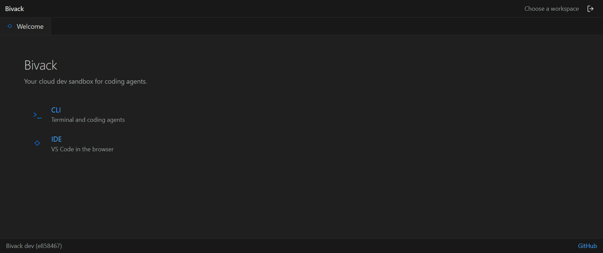
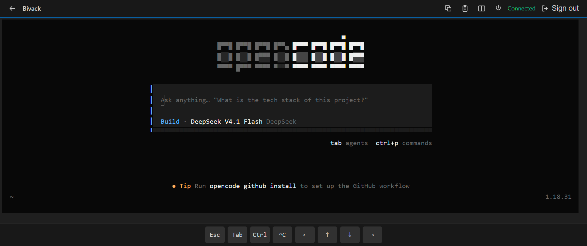
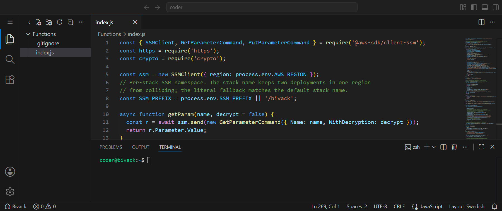
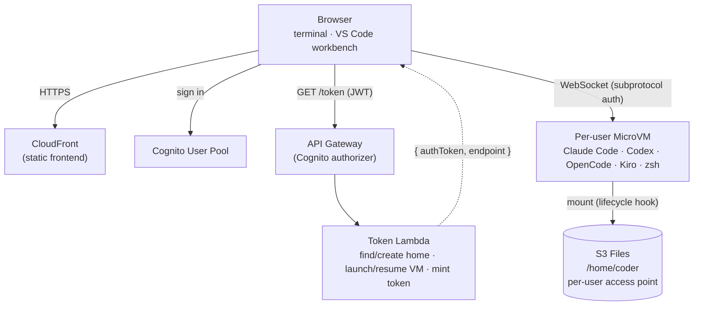

# Bivack

**Your cloud dev sandbox for coding agents.**

[](LICENSE)
[](https://nodejs.org/)
[](https://aws.amazon.com/serverless/sam/)
[](https://aws.amazon.com/lambda/)

Run your selected [Claude Code](https://www.anthropic.com/claude-code), [Codex CLI](https://developers.openai.com/codex/cli/), [OpenCode](https://opencode.ai), and [Kiro CLI](https://kiro.dev/docs/cli/setup.md) coding agents in per-user **AWS Lambda MicroVMs**, each with a persistent **Amazon S3** home directory, reached from a browser terminal or a browser VS Code workbench.

Each CLI uses the user's own provider login, so there are no shared API keys in the image. Close the tab and come back: files, history, and every login are still there.

Bivack is built on [Remote Developer (rDev)](https://github.com/singledigit/microvm-dev-environment) by [Eric Johnson](https://github.com/singledigit); see [Credits](#credits).

> A demo / small-team project, not a hardened product. Read [Security](#security) before deploying anywhere sensitive.

| Chooser | Terminal | VS Code workbench |
| :-: | :-: | :-: |
| [](docs/bivack-chooser.png) | [](docs/bivack-cli.png) | [](docs/bivack-ide.png) |

## Table of Contents

- [Quick Start](#quick-start)
- [Architecture](#architecture)
- [Terminals and CLIs](#terminals-and-clis)
- [Deploying](#deploying)
- [Security](#security)
- [Project Structure](#project-structure)
- [Limitations](#limitations)
- [Contributing](#contributing)
- [Changelog](CHANGELOG.md)
- [Credits](#credits)
- [License](#license)

## Quick Start

```shell
git clone https://github.com/gunnargrosch/bivack
cd bivack
cp deploy.env.example deploy.env
$EDITOR deploy.env          # AWS_PROFILE, AWS_REGION, LOGIN_EMAIL; select tools
./scripts/deploy.sh
```

The first run bootstraps the stack, builds the IDE, packages the MicroVM image, uploads the frontend, creates your first login, smoke-tests a throwaway VM, and prints the URL. Later runs reuse whatever has not changed.

Claude Code is enabled in the generated `deploy.env`. Uncomment Codex, OpenCode,
or Kiro there to add them before the first deploy.

| Requirement | Notes |
| --- | --- |
| AWS CLI v2 | authenticated (`aws configure`, `aws sso login`, or a named profile) |
| AWS SAM CLI | builds and deploys the stack |
| Node.js 20+ and npm | builds the IDE |
| `zip`, `python3` | packaging and small helpers in the scripts |
| AWS Lambda MicroVMs | available in your region; the examples use `us-east-1` |

Docker is not required. The MicroVM image is built server-side by the Lambda MicroVMs build service.

## Architecture



| Piece | What it does |
| --- | --- |
| **Frontend** | Chooser at `/`, terminal at `/cli/`, VS Code workbench at `/ide/`, shared login at `/login/`. Static from S3 behind CloudFront. The terminal installs as a PWA and shows a touch key bar on any coarse-pointer device. In the workbench, the File menu's "Go to Bivack Home" returns to the chooser. |
| **Auth** | Cognito user pool, admin-created users only. API Gateway's Cognito authorizer validates the JWT before the token Lambda runs. |
| **Token Lambda** | Reads the verified `sub`, finds-or-creates that user's S3 Files access point (`/users/<sub>`), launches or resumes their MicroVM, and mints a short-lived auth token. Hand-rolled SigV4. |
| **MicroVM image** | Amazon Linux 2023 with Node, Python 3.13, git, `gh`, the AWS CLI, `uv`, and the coding agent CLIs selected in `deploy.env`. `terminal.js` serves the PTY over WebSocket; `ide-agent.js` serves the workbench's file system and terminal on a second port. |
| **Home** | The `/run` lifecycle hook mounts the per-user S3 Files access point at `/home/coder` (`mount -o accesspoint=<id>`), so each user's home is isolated and survives restarts. |
| **Egress** | The private subnets reach the internet through a NAT instance by default (a `t4g.nano` running `iptables` masquerade, about $3/month) or an AWS NAT Gateway when `NAT_MODE=gateway` (about $33/month). This is the path MicroVMs use to reach model providers and package registries. The instance is patched weekly by an SSM association (`AWS-RunPatchBaseline`); a NAT Gateway needs no patching. |
| **Web search** | Each CLI uses its own built-in web tools; no MCP server is wired up. |

## Terminals and CLIs

Each selected CLI signs in once and keeps its session under `/home/coder`.

| CLI | Command | First-run login |
| --- | --- | --- |
| Claude Code | `claude` | sign in with your Claude plan |
| Codex | `codex` | sign in with your OpenAI account |
| OpenCode | `opencode` | `/connect` to add a provider |
| Kiro CLI | `kiro-cli` | `kiro-cli login` (device flow) |

Selected tools share workspace files while keeping their own configuration and history. Each is configured for unattended work inside its dedicated MicroVM: Claude Code uses `bypassPermissions`, Codex bypasses approvals and its local sandbox, and Kiro has a persistent allow-all policy. The MicroVM is the isolation boundary.

**Kiro CLI** is a hosted service unrelated to your AWS account. The browser terminal has no local browser, so `kiro-cli login` prints a URL and a one-time code; open it anywhere, sign in, and the session is stored under `~/.kiro` for good. Check it with `kiro-cli whoami`.

## Deploying

### Configuration

`deploy.env` is git-ignored and created for you from `deploy.env.example`:

| Key | Meaning |
| --- | --- |
| `AWS_PROFILE` | named AWS CLI profile (leave unset for the default profile) |
| `AWS_REGION` | region to deploy into |
| `LOGIN_EMAIL` | first Cognito login; deploy.sh creates it on the first deployment |
| `INITIAL_PASSWORD` | optional; temporary password for the first login, default random |
| `STACK_NAME` | optional, defaults to `bivack`; prefixes every AWS resource |
| `MEMORY_MIB` | optional; MicroVM memory tier (512, 1024, 2048, 4096, 8192), default 4096 |
| `IDLE_MAX_SECONDS` | optional; seconds without inbound traffic before a VM suspends, default 7200 |
| `IDLE_SUSPEND_SECONDS` | optional; seconds a suspended VM stays resumable, default 1800 |
| `MAX_LIFETIME_SECONDS` | optional; hard maximum VM lifetime, default 28800 |
| `BUDGET_EMAIL` | optional; enables monthly budget alerts at this address; unset disables budget creation |
| `BUDGET_USD` | optional; monthly cost budget in USD, default 25; used only when `BUDGET_EMAIL` is set |
| `NAT_MODE` | optional; private-subnet egress: `instance` (default, ~$3/mo) or `gateway` (~$33/mo) |
**Coding agents**

| Key | Meaning |
| --- | --- |
| `CLAUDE` | coding agent CLI version; enabled as `latest` in `deploy.env.example` |
| `CODEX`, `OPENCODE`, `KIRO` | optional coding agent CLI versions; unset by default |

**Other tools**

| Key | Meaning |
| --- | --- |
| `CDK`, `SAM`, `TOFU`, `TERRAFORM` | optional infrastructure CLI versions; unset by default |

Tool settings control what is baked into every MicroVM. Unset, commented-out,
or empty disables a tool; `latest` selects the current release; and a version
pins it. For example:

```shell
CLAUDE=latest           # install the current release
# OPENCODE=latest       # commented out disables it
KIRO=                   # empty also disables it
TOFU=1.12.6             # install this pinned release
```

Leave a tool setting unset to keep it out of the image. A tool setting change
changes the packaged MicroVM source hash, so the next `./scripts/deploy.sh`
rebuilds the image automatically. `TOFU=latest` and `TERRAFORM=latest` resolve
their version during deployment, which is printed before the image is packaged.
They are supported for convenience, but pinning their versions is recommended
for reproducible images.

### What deploy.sh does

1. Checks the required tools and your AWS credentials.
2. First deploy only: bootstraps the stack without the MicroVM image, to create the buckets and roles.
3. Builds the IDE when its sources changed (or `ide/dist` is missing).
4. Packages `microvm/` and deploys the stack with the image.
5. Uploads the frontend and IDE to S3 and invalidates CloudFront when their
   source, built IDE assets, or generated runtime configuration changed.
6. Creates the first login from `LOGIN_EMAIL` with a random temporary password, printed once by the deploy and changed on first sign-in.
7. Launches a throwaway MicroVM, probes the S3 Files mount and outbound internet, then terminates it.

### Flags

| Flag | Effect |
| --- | --- |
| *(none)* | build what changed, then deploy |
| `--frontend-only` | re-upload the frontend and IDE only; no SAM, no image |
| `--no-smoke` | skip the throwaway smoke-test VM |
| `--build-ide` | force an IDE rebuild |
| `--review` | show the CloudFormation changeset and confirm before applying |
| `--dry-run` | on an existing stack, create but do not execute a CloudFormation changeset; skips frontend publishing, login creation, and smoke testing |

### Upgrading

Pull and run the same command:

```shell
git pull
./scripts/deploy.sh
```

`deploy.sh` rebuilds only what changed: the IDE when its sources changed, the MicroVM image when `microvm/` changed (5-10 minutes), and the frontend when its source, built IDE assets, or generated runtime configuration changed. A no-change run skips the IDE rebuild, MicroVM artifact upload, frontend publishing, and CloudFront invalidation; it still runs SAM's no-op deploy check and the smoke test (unless `--no-smoke` is set). The S3 Files home and the buckets are not touched, so user files, history, and logins survive. Keep `STACK_NAME` unchanged; a different name stands up a new stack instead of upgrading.

After a MicroVM image upgrade, running VMs keep the old image until they recycle (they suspend on idle and terminate after their maximum lifetime). To move a user onto the new image immediately, terminate their VM from the terminal's power button and reload; the next sign-in launches a fresh VM from the newest image.

To review an infrastructure change before applying it:

```shell
./scripts/deploy.sh --review
```

This prints the CloudFormation changeset and waits for confirmation. Check for `Replace` on stateful resources (`UserPool`, `WorkspaceBucket`, `S3FilesFileSystem`); a replacement there would drop users or data, so migrate deliberately rather than confirming. Bumping `S3FilesFileSystem`'s `ClientToken` is the deliberate exception: it forces a replacement and is the recovery path for a wedged synchronization state.

### Tearing down

```shell
./scripts/teardown.sh          # prompts for the stack name
./scripts/teardown.sh --yes    # no prompt
```

Removes the stack, all three buckets (the workspace and artifact buckets are `Retain`, so it empties them including versions), the Cognito pool, every SSM parameter under the stack prefix, running MicroVMs, the MicroVM images, and the log groups. Safe to re-run.

### Inspecting

```shell
aws cloudformation describe-stacks --stack-name bivack \
  --query "Stacks[0].Outputs" --output table

# Reach into a running MicroVM (break-glass; there is no SSH)
set -a; . ./deploy.env; set +a
cd tools && npm install && cd ..            # first time only
node tools/exec.js --user you@example.com   # interactive shell
node tools/run-remote.js --user you@example.com 'uname -a'
```

`BIVACK_USER` can replace `--user`. The user must have logged in at least once so their VM exists.

## Security

- **Auth is Cognito, per-user.** Users are admin-created (no self-signup); each gets their own MicroVM and a home isolated to their `sub`. API Gateway validates the JWT before the Lambda runs.
- **The VM starts with no AWS credentials.** Its own role (`MicroVmExecutionRole`) only mounts S3 Files and looks up its own endpoint, so it grants nothing against your accounts. To use AWS, authenticate inside the VM: `aws configure sso`, then `aws sso login --profile <name> --use-device-code`. There is no browser here, so the device code flow is the one that completes. Profiles and credentials persist under `~/.aws` in the home. Provider logins (Claude, Codex, OpenCode, Kiro, and `gh`) also live in each user's home.
- **`coder` has passwordless `sudo` inside its own VM.** Fine, since the VM and home are per-user, but a user is root within their own sandbox.
- **Model-provider spend** is billed to each user's own provider account. There is no sandbox-level cap.
- **No network isolation of the workload.** MicroVMs have open outbound internet by default.

For a production multi-tenant deployment you would additionally want spend controls and egress restrictions.

## Project Structure

```
template.yaml          all AWS infrastructure, including the MicroVM image as an
                       AWS::Serverless::MicrovmImage resource
deploy.env.example     copy to deploy.env and fill in (git-ignored)
NOTICE                 upstream attribution (Remote Developer / Eric Johnson)
functions/
  token-vend/          token Lambda: S3 Files access point, MicroVM lifecycle, auth token
frontend/              chooser, terminal (PWA), login, shared VS Code theme
  landing.html         chooser at /
  index.html           xterm.js terminal at /cli/ (PWA entry point)
  login.html           shared login at /login/
  vscode.css           Dark Modern tokens shared by the pages
  landing.css / login.css / cli.css   per-page styles
ide/                   the embedded VS Code workbench (Vite + monaco-vscode-api)
  src/main.ts          workbench bootstrap and service overrides
  src/wsfs.ts          vscode.FileSystemProvider over the WebSocket
  src/wsclient.ts      WebSocket client with reconnect
  src/terminal.ts      workbench terminal backend
  src/auth.ts          Cognito session and token API
  src/authprovider.ts  Cognito account provider for the Accounts menu
microvm/               MicroVM image
  Dockerfile           AL2023 + Node/Python/uv/git/gh/AWS CLI + the coding CLIs
  entrypoint.sh        starts hooks.js, ide-agent.js, and terminal.js
  hooks.js             lifecycle hooks: mounts the home on /run, samples the
                       cold path on /validate
  mount-home.sh        per-user S3 Files mount and image-owned config refresh
  terminal.js          WebSocket PTY server (ttyd protocol)
  ide-agent.js         WebSocket file/terminal agent for the workbench
  agents/AGENTS.md     shared environment briefing, seeded to all four agents
  shell/
    env.sh             shared environment, sourced by both rc files
    zshrc / bashrc     seeded shell config
  claude/
    settings.js        refreshes unattended Claude mode, leaving other settings alone
  codex/
    run.sh             default wrapper: unattended, OpenAI login
  kiro/
    permissions.yaml   Kiro's unattended, allow-all permissions
scripts/
  deploy.sh            one-command deploy
  teardown.sh          removes the stack and everything it leaves behind
tools/                 break-glass utilities for a running MicroVM
  exec.js / exec.sh    interactive shell into a user's MicroVM
  run-remote.js        non-interactive remote command runner
  resolve-mvm.js       shared: email -> Cognito sub -> per-user MicroVM
  smoke-probe.js       deploy-time mount + internet probe
```

## Limitations

- **Web extensions only in the IDE.** The workbench is the browser build of VS Code, so only extensions with a web entrypoint install. Desktop-only extensions show "not available in the web platform". Microsoft and GitHub sign-in and Settings Sync are not available either; they are Microsoft-hosted built-ins.
- **No git in the IDE.** The browser cannot spawn the git binary and monaco-vscode-api does not ship VS Code's git extension, so Source Control has no provider. Use `git` and `gh` in the terminal tab.
- **MicroVM ingress.** The endpoint accepts the auth token only in the `X-aws-proxy-auth` header. A browser cannot set that header on navigation or subresource loads, which is why the IDE is a self-hosted workbench talking to the VM over WebSocket rather than a served web IDE.
- **IDE settings are per-browser.** The workbench keeps user settings (theme, keybindings) in browser storage, not the VM, so they do not follow you across browsers or survive clearing site data. Workspace settings (`.vscode/settings.json`) do live in the VM. Auto-save starts off and tooling dotfiles are hidden with `files.exclude`; both are overridable defaults.
- **The home is network storage.** `/home/coder` is S3 Files over NFS, so many small file operations are slower than local disk, which shows when a CLI scans its config or caches. The bucket is versioned (S3 Files requires it) and noncurrent versions expire after 7 days.
- **One region.** The stack targets a single region; MicroVM availability varies.

## Contributing

Contributions are welcome: bug reports, feature ideas, and pull requests. For anything non-trivial, open a [GitHub issue](https://github.com/gunnargrosch/bivack/issues) first so the approach can be agreed before you build it.

### Development setup

The deploy script is also the development loop; there is no separate dev server. [Quick Start](#quick-start) has the clone and deploy steps. `--review` previews infrastructure changes before applying them, and `--frontend-only` re-uploads the frontend and IDE without a stack update.

### Making a change

- Branch off `main` and keep each pull request to one thing.
- Follow [Conventional Commits](https://www.conventionalcommits.org): `type(scope): description`, with `feat`, `fix`, `docs`, `refactor`, `test`, or `chore`.
- Run the deploy before opening the pull request. It rebuilds whatever changed and smoke-tests a throwaway MicroVM, so a clean run means the image still boots with the home mounted and outbound internet working.
- For a frontend or IDE change, `./scripts/deploy.sh --frontend-only` is enough; build the IDE first if you changed it. For a `microvm/` change, expect a 5-10 minute image rebuild.
- When a change is worth users updating to (a MicroVM image or `template.yaml` change especially), add a [CHANGELOG](CHANGELOG.md) entry and cut a release: `gh release create vX.Y.Z --generate-notes`. Older deployments show an "update available" nudge in the footer.

### What to be careful with

- **Stateful resources.** `UserPool`, `WorkspaceBucket`, and `S3FilesFileSystem` hold users and data. A change that makes CloudFormation replace them drops that data. Check with `--review` and call it out in the pull request.
- **Image size and cold start.** The MicroVM image is snapshotted and prefetched, so large additions slow the first launch. Keep the `/validate` hook in step with what a real session touches.
- **No AWS credentials in the sandbox, by design.** Do not add broad AWS access back; see [Security](#security).

All contributions are accepted under the project's [MIT-0 license](#license).

## Credits

Bivack is a derivative of [Remote Developer (rDev)](https://github.com/singledigit/microvm-dev-environment) by [Eric Johnson](https://github.com/singledigit), used under the MIT-0 license. The upstream copyright is retained in [NOTICE](NOTICE).

## License

[MIT-0](LICENSE) — MIT No Attribution.

This is a personal project and is not an official AWS or Anthropic product.
